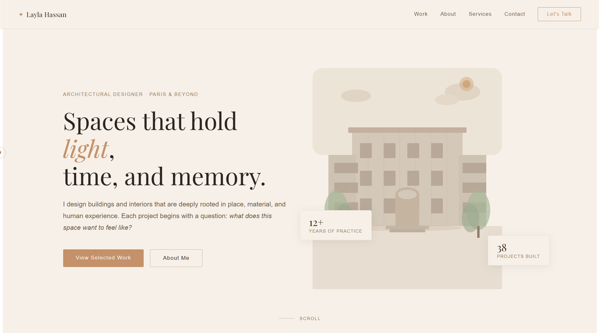

# My Portfolio

Professional architectural portfolio built with React, TypeScript, and Vite. The website presents selected projects, services, personal profile content, and contact information through a clean editorial layout.



## Overview

My Portfolio is a responsive single-page application designed for an architectural designer. It focuses on strong visual hierarchy, refined spacing, smooth interactions, and a polished presentation style suitable for personal branding and client-facing work.

## Features

- Responsive layout for desktop, tablet, and mobile screens
- Hero section with portfolio highlights and visual identity
- Selected work section with project cards and category filtering
- About, services, contact, and footer sections
- Smooth in-view animations powered by Intersection Observer
- Custom cursor experience on desktop
- Mobile navigation menu
- TypeScript-first React component structure
- Production-ready Vite build setup
- ESLint configuration for code quality

## Tech Stack

- React 19
- TypeScript
- Vite
- ESLint
- CSS-in-JS style objects

## Project Structure

```text
my-portfolio/
|-- public/
|   |-- favicon.svg
|   |-- icons.svg
|   `-- image.png
|-- src/
|   |-- components/
|   |   |-- Header.tsx
|   |   |-- HeroSection.tsx
|   |   |-- WorkSection.tsx
|   |   |-- ProjectCard.tsx
|   |   |-- AboutSection.tsx
|   |   |-- ServicesSection.tsx
|   |   |-- ContactSection.tsx
|   |   `-- Footer.tsx
|   |-- data/
|   |   `-- index.ts
|   |-- hooks/
|   |   `-- index.ts
|   |-- styles/
|   |   `-- index.ts
|   |-- types/
|   |   `-- index.ts
|   |-- App.tsx
|   `-- main.tsx
|-- index.html
|-- package.json
|-- tsconfig.json
`-- vite.config.ts
```

## Getting Started

Install dependencies:

```bash
npm install
```

Start the development server:

```bash
npm run dev
```

Open the local URL shown in the terminal. Vite usually runs on:

```text
http://localhost:5173/
```

## Available Scripts

| Command | Description |
| --- | --- |
| `npm run dev` | Starts the Vite development server. |
| `npm run build` | Builds the app for production in the `dist` directory. |
| `npm run lint` | Runs ESLint across the project. |
| `npm run preview` | Serves the production build locally for preview. |

## Deployment

The project can be deployed on any static hosting platform, including Vercel, Netlify, GitHub Pages, or similar services.

Recommended deployment settings:

```text
Build command: npm run build
Output directory: dist
Framework: Vite / React
```

## Production Check

Before publishing a new version, run:

```bash
npm run build
npm run lint
```

Both commands should complete without errors.

## Customization

Main project content can be updated from:

- `src/data/index.ts` for navigation items, projects, services, and categories
- `src/components/HeroSection.tsx` for hero copy and headline content
- `src/styles/index.ts` for colors, spacing, typography, and layout styles
- `index.html` for page title, meta tags, and favicon
- `public/image.png` for the README preview image

## License

This project is private and intended for personal portfolio use.
